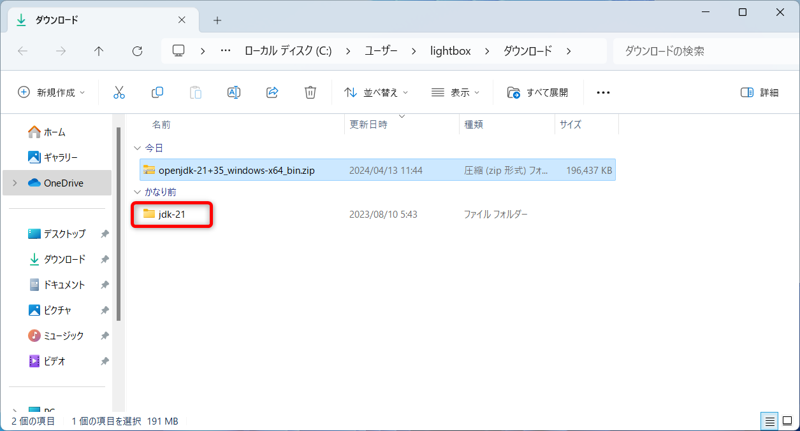
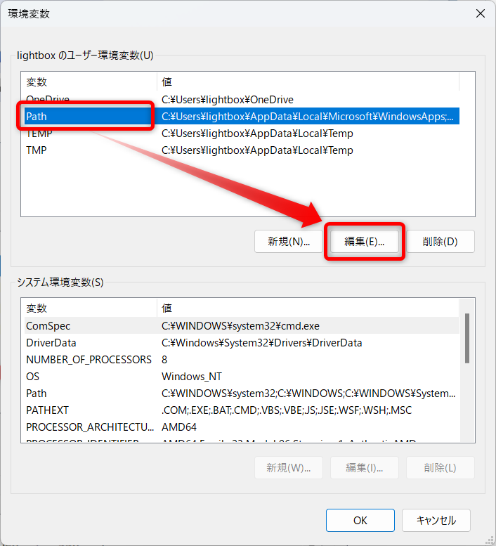

# Java

## 使用するテキスト

[スッキリわかるJava入門 第4版](https://book.impress.co.jp/books/1123101044)

## 開発環境

- Visual Studio Code
- Java21 (OpenJDK21)

## 開発環境の構築手順

###  Visual Studio Codeインストール

[こちらを参照](https://github.com/room202/vscode/)

- 拡張機能を追加
  - Extension Pack for Java (Javaプログラミングに便利な機能一式)

### Java21 (OpenJDK21)のダウンロードと設定

下記サイトからJava21(OpenJDK21)のzipファイルをダウンロードする

https://jdk.java.net/java-se-ri/21


### ダウンロードしたzipファイルを解凍(展開)する

対象のzipファイルの上で、`Shiftキーを押しながら右クリック`→[7-Zip]→[ここに展開]  
※7-Zipをインストールしていなければ[こちらから](https://github.com/room202/7-zip)インストールをする


### 解凍(展開)したフォルダ名の変更

フォルダ名を`jdk-21`から`java`に変更  



### 解凍(展開)したフォルダの移動

`java`フォルダを切り取って`C:\`の真下に貼り付け(移動)  
※`C:\java`となればOK


### binフォルダの確認

`C:\java\bin`フォルダと、その中身がある事を確認する


###  環境変数の追加

Windowsスタートボタンの右横にある検索バーで`env`と検索する

検索にヒットした`環境変数を編集`をクリックして起動する


`Path`をクリックしてから`編集`をクリック  


`新規`をクリックして環境変数を追加する  


`C:\java\bin`を追加して`OK`をクリック  


環境変数画面は`OK`をクリックして閉じる  


###  環境変数の確認

Windowsスタートボタンの右横にある検索バーで`cmd`と検索する

検索にヒットした`コマンドプロンプト`をクリックして起動する


コマンドプロンプトが起動する  


下記コマンドを入力してEnterキーで実行する
```bash
java --version
```


このような画面が表示されたらOK  


続いて下記コマンドを入力してEnterキーで実行する
```bash
javac --version
```


このような画面が表示されたらOK  


## ソースコードの保存場所

C:\work\java
